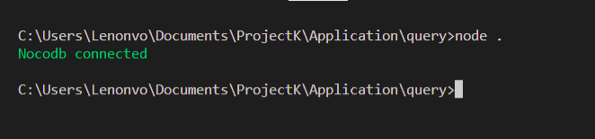

# nocoQuery


## Getting Started

```
const noco = require('nocoQuery')

//for example
const url = "http://localhost:8080/api/v1/db/data/noco/*"
const table = "users"
const token = "................"

const db = new nocoQuery({host: host, table: table, xc_token: token});

//for connecting to database
db.connect();

```




### For getting data

```

db.get(query, (data) => console.log(data))

```


### For posting data

```

db.post({
    "username": "Sasuke Uchiha",
    "password: "Naruto Uchiha
});

```


### Lacks (for now)

* Delete
* Patch